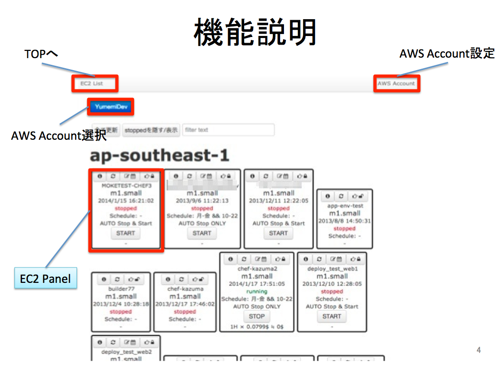
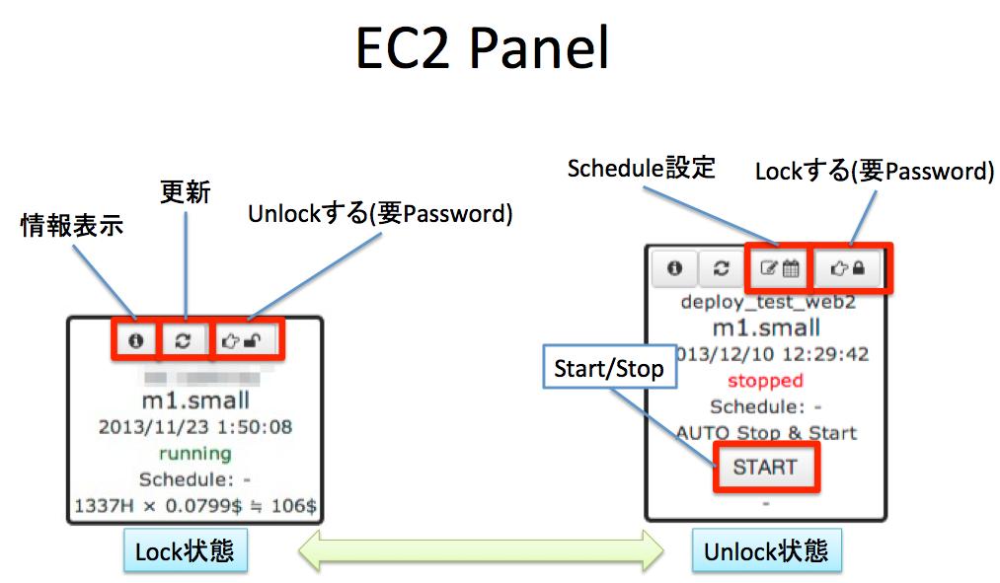
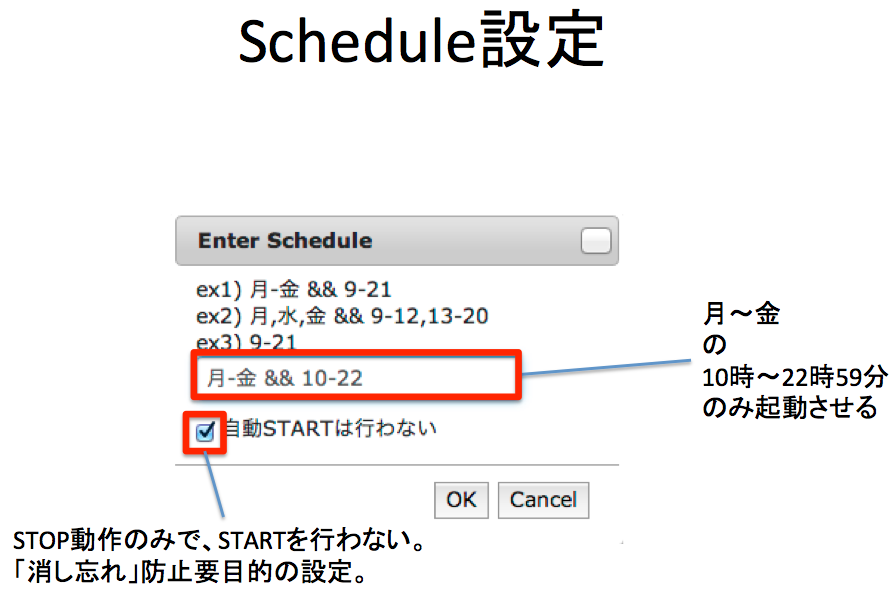

はじめに
=======

「開発サーバのようなEC2 Instanceを起動しっぱなしにしていると、お金の無駄だよね」という発想のもと作ったものです。

* 主に開発サーバをこまめにStopすることを目的としています。開発サーバは営業時間内くらいしか使わないことがほとんどですので、50%くらい費用の節約できるのではないかと思っています。
* EC2 Instance毎に、このConsoleでStart/Stopを許可するか、という設定(Lock/Unlock)があります。
* Lock/Unlock は 右上のアイコンをクリックして、 Admin Passwordを入力すると変更できます。今はだれでもこのAdminPasswordが閲覧できますが、、、。
* UnlockされているEC2 Instanceは start / stop ボタンが表示され、Start/Stopができます
* また、スケジュールが入力できて、曜日・時間帯 を指定して、Start/Stopする時間を設定できます
* Stop Onlyのスケジュールも指定可能です（消し忘れ防止の用途）


注意
-----
* サービスしているInstanceをUnlockするのは危険なのでやめましょう。








How To Setup
=======

System Requirement
----------------------

* ruby >= 2.0.0
* bundler

Setup
-----

```
git clone https://github.com/mokemokechicken/AWSSimpleConsole.git
cd AWSSimpleConsole
bundle install --path=vendor/bundle
bundle exec rake db:migrate
bundle exec rails server
```


Cron for Scheduled Start/Stop
----------------

`/etc/cron.d/awssimpleconsole` などを以下のようにしてください。

* `serverapp` は 実行ユーザ
* `/home/serverapp/awssimpleconsole` は アプリケーションが置いてあるDir

```/etc/cron.d/awssimpleconsole
1 * * * * serverapp  cd /home/serverapp/awssimpleconsole; RAILS_ENV=production bundle exec rails runner Tasks::ExecScheduleTask.execute 2>&1 2>&1 > /dev/null
```


設定
====

最初、対象としたいAWSのテナント毎にIAMユーザを作成する必要があります。


IAM ユーザ の 設定
-------------------

下記のようにしてください。
意味として以下のようになっています。

* 全てのEC2 Instanceの情報の参照
* {APIStartStop: YES} と TAGがついているEC2 Instanceに対して、 Start/Stop/Reboot を許可
* 全てのEC2 InstanceへのTAGの付与と削除の許可
* 全てのELBに対して、EC2 Instanceの「追加・削除・参照」の許可
    * ELBの操作が必要なのは、EC2 InstanceをELBに付けたままStopすると、Startしても正常に疎通しないからです。従って、ELBに付いているEC2は起動時に、ELBに対して登録の削除・追加をしています。

```
{
    "Version": "2012-10-17",
    "Statement": [
        {
            "Sid": "Stmt1384933267000",
            "Effect": "Allow",
            "Action": [
                "ec2:Describe*"
            ],
            "Resource": [
                "*"
            ]
        },
        {
            "Sid": "Stmt1384933267001",
            "Effect": "Allow",
            "Action": [
                "ec2:RebootInstances",
                "ec2:StartInstances",
                "ec2:StopInstances"
            ],
            "Condition": {
                "ForAnyValue:StringEquals": {
                    "ec2:ResourceTag/APIStartStop": "YES"
                }
            },
            "Resource": [
                "arn:aws:ec2:*"
            ]
        },
        {
            "Sid": "Stmt1386654386000",
            "Effect": "Allow",
            "Action": [
                "ec2:CreateTags",
                "ec2:DeleteTags"
            ],
            "Resource": [
                "*"
            ]
        },
        {
            "Sid": "Stmt1389937836000",
            "Effect": "Allow",
            "Action": [
                "elasticloadbalancing:DeregisterInstancesFromLoadBalancer",
                "elasticloadbalancing:DescribeLoadBalancers",
                "elasticloadbalancing:RegisterInstancesWithLoadBalancer"
            ],
            "Resource": [
                "*"
            ]
        }
    ]
}
```

Login認証の追加
--------------

[Devise](https://github.com/plataformatec/devise) を認証機能として使っていますが、最初はOFFにしてあります。
Deviseのマニュアルなどを読みながら、

* `config/initializers/awssimpleconsole.rb` に `ApplicationController.config.login_required = false` を `true` にします
* `app/models/user.rb`
* `config/initializers/devise.rb`

辺りを触れば良いのではないかと思います。


License
=======

[MIT License](http://mokemokechicken.mit-license.org/)

